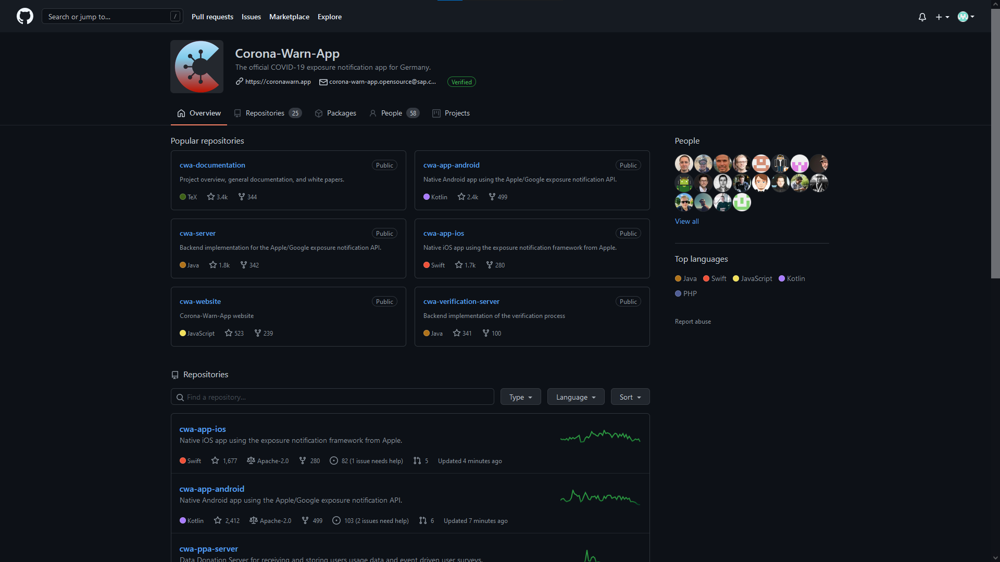
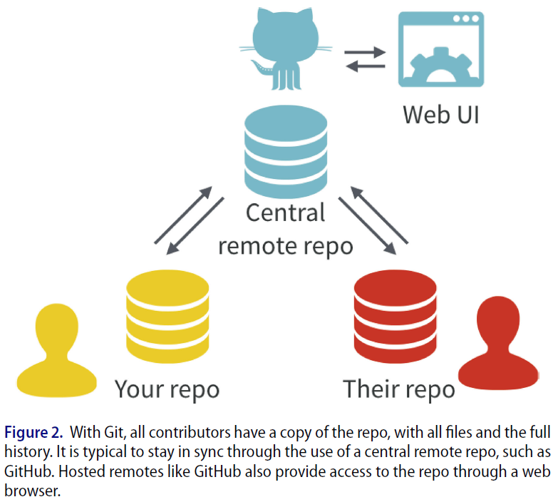
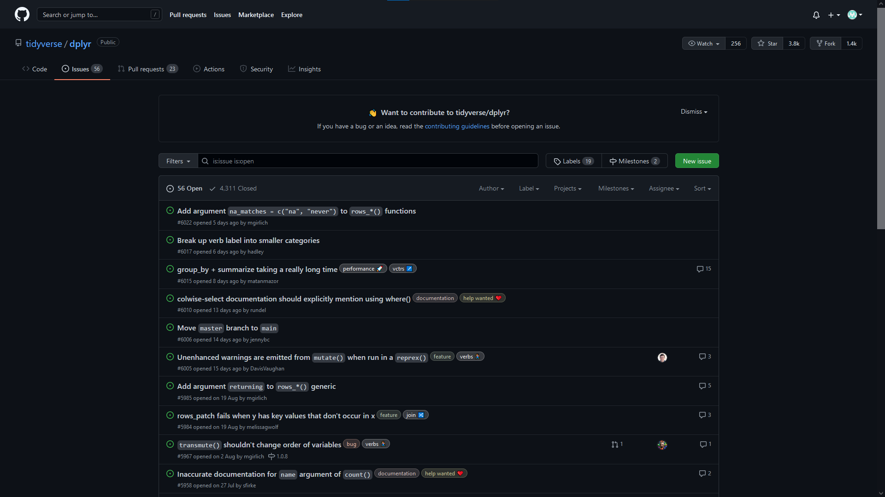

```{r setup, include=F}

# knitr options
knitr::opts_chunk$set(
  comment = ">",
  collapse = F
)

# package management
if (!require("pacman")) install.packages("pacman")
pacman::p_load(
  xaringanthemer, metathis, tidyverse, magrittr
)
pacman::p_load_gh("hadley/emo", "gadenbuie/xaringanExtra")

# xaringan custom setup
xaringanthemer::style_mono_accent(
  base_color = "#000000",
  link_color = "#0000EE",
  header_font_google = google_font("Josefin Sans"),
  text_font_google = google_font("Montserrat", "700b", "400"),
  code_font_google = google_font("Fira Mono"),
  colors = c(red = "#f34213", white = "#FFFFFF"),
  code_font_size = "smaller",
  code_inline_background_color = "#F4F4F4",
  outfile = "./custom/xaringan-themer.css"
)

xaringanExtra::use_panelset()
xaringanExtra::use_webcam()

xaringanExtra::use_extra_styles(
  hover_code_line = T,
  mute_unhighlighted_code = T
)
```

class: center, middle, hide-count
count: false

# `r rmarkdown::metadata$title`
### `r rmarkdown::metadata$subtitle`

___

**`r rmarkdown::metadata$author`**

`r rmarkdown::metadata$date`  
.small[(updated: `r Sys.Date()`)]

<br><br>

<a href="https://www.wiwi.uni-muenster.de/"></a> <a href="https://www.wiwi.uni-muenster.de/ctrl/aktuelles"></a> <a href="https://www.wiwi.uni-muenster.de/iff2/de/news"></a>

---

## Agenda

**1 Motivation**  
> 1.1 Why Git and GitHub?  
1.2 What is Git?  
1.3 What is GitHub?

**2 Git and GitHub Fundamentals**  
> 2.1 Setup and Installation  
2.2 Authentication  
2.3 Repositories (aka Repos)  
2.4 The Standard Git Workflow
  
**3 Advanced Git and GitHub Concepts**  
> 3.1 Branching  
3.2 Merge Conflicts  
3.3 When `r emo::ji("pile_of_poo")` Hits the Fence  
3.4 File Tracking  
3.5 GitHub Issues

```{r, echo=F}
xaringanExtra::use_progress_bar(color = "#000066", location = "bottom")
```

---

```{r, echo=F, out.width='40%', out.extra='style="float:right; padding:20px"'}
knitr::include_graphics("http://phdcomics.com/comics/archive/phd101212s.gif")
```

## 1 Motivation
### 1.1 Why Git and GitHub?

- Git is a practically relevant technology, in particular within tech-/data-driven teams and organizations.<br><br> 
- Mastering Git helps you improve your data science workflow, in particular in collaborative settings.<br><br> 
- GitHub enables you to showcase your own work and skills publicly.<br><br> 
- Releasing source code and data via GitHub reflects open science principles (e.g., accessibility and reproducibility).<br><br>
- Your assignments will be distributed and handed-in via GitHub. Also, we can track your progress and help you along the way.

.footnote[
_Src: [phdcomics](http://phdcomics.com)_
]

???
Learning Git appears hard at the beginning, but only because you are used to your own (imperfect) workflows

---

## 1 Motivation

```{r, echo=F, out.width='30%', out.extra='style="float:right; padding:10px"'}
knitr::include_graphics("https://upload.wikimedia.org/wikipedia/commons/thumb/e/e0/Git-logo.svg/1280px-Git-logo.svg.png")
```

### 1.2 What is Git?
[Git](https://git-scm.com/) is a decentralized **version control system** (VCS) that helps you track changes of your files (e.g., data, figures, documents, code) over time. Somewhat comparable to Word's "track changes" feature, only more powerful. It records your entire file history and let's you roll-back to previous versions of your files.

???
keep track of:
- what has changed
- who has changed it
- when was it changed

--

```{r, echo=F, out.width='20%', out.extra='style="float:right; padding:10px"'}
knitr::include_graphics("https://pbs.twimg.com/profile_images/1414990564408262661/r6YemvF9_400x400.jpg")
```

### 1.3 What is GitHub?
[GitHub](https://github.com/) is a platform that let's you host and distribute Git-based projects publicly. It enables remote collaboration on these projects and is particularly popular among developers and data scientists. Other people can contribute to your code base, while you can also contribute to other projects.

While Git is essentially a software that runs locally on your computer, GitHub is a web-service which let's you share your files and projects with others remotely.

???
- your collaborator may be your future self
- GitHub essentially complements Git

---

## 1 Motivation

```{r, echo=F, out.width='70%', fig.align='center'}

```

.center[*Src: [Corona-Warn-App GitHub Repository](https://github.com/corona-warn-app)*]

---

## 2 Git and GitHub Fundamentals
### 2.1 Setup and Installation

Install the [Git Client](https://git-scm.com/) on your local machine and create a [GitHub](https://github.com/) account. In case you struggle with one of the setup steps, refer to [Happy Git and GitHub for the useR, ch. 4-6](https://happygitwithr.com/github-acct.html).

--

In general, you have various options for using Git on your computer:
- Integrated Development Environment (e.g., RStudio, Visual Studio Code)
- Dedicated Git Client (e.g., GitKraken)
- Git Command Line Interface (CLI)

???
In the following, we will see all examples in the context of the RStudio IDE as well as executed in the CLI, so that you get a general understanding of what is happening under the hood.

---

## 2 Git and GitHub Fundamentals
### 2.2 Authentication

When you use Git for the first time, you must introduce yourself to Git (i.e. choose a username and mail-address with which you authenticate yourself). If your credentials match with your GitHub credentials, Git and GitHub can be linked.

**1. Step:** Run in the terminal (i.e. using the Git CLI)

```
git config --global user.name <username>
git config --global user.email <email>
git config --global --list
```

--

**2. Step:** Create a personal access token (PAT)

Create a [personal access token](https://docs.github.com/en/authentication/keeping-your-account-and-data-secure/creating-a-personal-access-token) on GitHub with which you login instead of your GitHub password (token-based authentication is mandatory as of [July 2020](https://github.blog/2020-12-15-token-authentication-requirements-for-git-operations/)). Use this token as passwort whenever your are prompted by Git to enter your username and password!

---

## 2 Git and GitHub Fundamentals
### 2.3 Repositories (aka Repos)

Repositories are directories (i.e. folders) of files that are managed by Git. Usually, you will have one repository for each project (e.g., assignment). Repositories can live *locally* on your computer as well as *remotely* in the cloud (e.g., GitHub).

**Repository for this presentation:**
```{r, eval=F}
list.files("C:/Users/s_scho53/Desktop/.../version-control-with-git-and-github", all.files = T)
```
```{r, echo=F}
list.files("C:/Users/s_scho53/Desktop/L09_Desktop/workshops/version-control-with-git-and-github", all.files = T)
```

---

name: create-repo

## 2 Git and GitHub Fundamentals
### 2.3 Repositories (aka Repos)

.panelset[
.panel[.panel-name[Local First]
1. For each assignment, or project in general, create a local folder on your computer.
2. Make it an RStudio Project.
3. Make it a Git repository and link it to the remote GitHub repository.
```
git init
git remote add origin <remote url>
git remote -v
```
Here, `origin` is the "shortname" of the remote repository. You can use any other name instead, however, `origin` is the Git default and hence works nicely out of the box.
]
.panel[.panel-name[Remote First (Clone)]
**Cloning:** Create a local copy of your GitHub repo, make changes and apply changes to your remote repo.
  
1. Create a new repository on your GitHub account.
2. Copy its contents to your local repository (using CLI or RStudio).
```
git clone <remote url>
git remote -v
```
`git clone` automatically links your local and remote repository (no need to use `git remote add`).
]
.panel[.panel-name[Remote First (Fork)]
**Forking:** Create a copy of someone else's repo in your GitHub account, make changes locally without affecting the original repo and then propose your own changes to the original repo.
]
]

---

## 2 Git and GitHub Fundamentals
### 2.4 The Standard Git Workflow

**1. Make Changes:** Make local changes to your repository (e.g., add new files, delete files, rename files or edit files). These changes are not yet reflected in your remote GitHub repo!

**2. Commit Changes:** A *commit* creates a snapshot of your repo, i.e. records the current state of your files.

- Tell Git which changes you would like to upload to your remote repository (the *remote*). These changes are submitted to the *staging area*, a "waiting room" where you gather all the changes for your commit.
```
git add <file/dir>
```
- Commit your changes to the remote repository, by taking a snapshot of repository.
```
git commit -m "enter meaningful commit message"
```

.footnote[
*Note: Commit messages state the intent of your changes. They should briefly describe the changes that you are about to submit.*
]

???
- added changes could be: new files, deleted files, edited files or even single lines of code in your files

---

## 2 Git and GitHub Fundamentals
### 2.4 The Standard Git Workflow

```{r, echo=F, out.width='50%', out.extra='style="float:right; padding:20px"'}
knitr::include_graphics("https://happygitwithr.com/img/commit-diff-sha-tag.png")
```

**Commit history**: The sequence of commits over time is represented by the commit history (stored in your repo's `.git` folder).

Every commit is accompanied by a commit message as well as a SHA hash which uniquely identifies each commit.

**Diff:** A diff records the differences between two commits (i.e. repository snapshots).

The most recent state of your repository is hence an accumulation of the contents of your initial commit plus any number of diffs.

.footnote[
*Note: Git mostly works with plain text files (e.g., `.md`, `.Rmd`, `.R`, `.md`, `.html`, etc.). It won't be able to track diffs between binary files such as Word documents, Excel spreadsheets, PDF files or images.*
]

---

## 2 Git and GitHub Fundamentals
### 2.4 The Standard Git Workflow

**3. Push Changes:** When you have taken one or several snapshots (i.e. commits), you are ready to upload your changes to your remote GitHub repo using `git push`.

```
git push
```

If you have first created a local repository and then linked it to your GitHub repo subsequently (["local first"](#create-repo)), Git may prompt you once to establish an upstream connection to your remote repo.

```
git push --set-upstream origin main
```

???
main is the name of the default branch

---

## 2 Git and GitHub Fundamentals
### 2.4 The Standard Git Workflow

```{r, echo=F, out.width='35%', out.extra='style="float:right; padding:10px"'}

```

**4. Pull Changes:** Pulling is the complement of `git push`. It let's you download recent changes (e.g., submitted and pushed commits by your collaborators) and update your local repo. 

```
# fetch the new updates from the remote
git fetch origin

# merge the changes into your local repo
git merge origin/main master

# or use the pull shortcut to fetch + merge
git pull origin master
```
Usually, simply using `git pull` will be sufficient since you have already linked your local and remote repository.

.right[
*Src: [Bryan (2018)](https://www.tandfonline.com/doi/full/10.1080/00031305.2017.1399928)*
]

???
- each user has an own version of the repo locally
- GitHub acts as the central node for holding the master version of the repo

---

## 3 Advanced Git and GitHub Concepts
### 3.1 Branching

Branches allow you to "detour" from your main code base (i.e. repository). You create a new snapshot of your repository in which you can work on the same files without affecting the main code base.

```{r, echo=F, out.width='50%', out.extra='style="float:right; padding:10px"'}
knitr::include_graphics("https://www.nobledesktop.com/image/gitresources/git-branches-merge.png")
```

**Branching** enables you to
- develop a new analysis while keeping the main code base intact,
- experiment with new ideas without breaking the code base,
- create a back-up of your code base.

This is particularly useful if you are working in a team and would like to work on your code in parallel (e.g., different people working on different features or tasks).

.right[
*Src: [noble desktop](https://www.nobledesktop.com/learn/git/git-branches)*
]

---

## 3 Advanced Git and GitHub Concepts
### 3.1 Branching

.panelset[
.panel[.panel-name[Create New Branch]
```
git branch experimentation

git branch -v
```

```
>   experimentation <commit SHA> <commit message>
> * master          <commit SHA> <commit message>
```
Note that the default branch of your local repository is called `master`. In contrast, when you create a remote GitHub repository, the default branch is usually called `main`. The `*` indicates the current branch, aka `HEAD`.
]
.panel[.panel-name[Switch Branches]
```
git checkout experimention

git branch -v
```

```
> * experimentation <commit SHA> <commit message>
>   master          <commit SHA> <commit message>
```

Under the hood, `git checkout` updates all the files in your local repo to reflect the state of your `experimentation` branch. From now on, all new commits will be assigned and pushed to this branch.
]
.panel[.panel-name[Merge Branches]
Make some changes and merge these changes back into the `master` branch. `git merge` integrates these changes back into the `master` branch.

```
git checkout master

git merge experimentation
```

Merges can be made between branches in the same repo as well as between original and forked repositories. The latter type of merge goes by the name of **pull request** (you request for the changes in your fork to be "pulled" into the original repository).
]
]

???
PR: mechanism for making contributions ot open source projects

---

## 3 Advanced Git and GitHub Concepts
### 3.2 Merge Conflicts

Merge conflicts arise when contradictory commits address changes made to the same file or lines of code. Most likely you will encounter them when there are two commits involving edits of the same code snippet. 

```
<<<<<<< HEAD
your changes
=======
"incoming" changes
>>>>>>> experimentation
```

Merge conflicts must be resolved manually by a new commit, which either selects the correct change from the two proposed changes or integrates the changes into each other.

---

## 3 Advanced Git and GitHub Concepts
### 3.2 Merge Conflicts

Merge conflicts are easier to prevent if
- you avoid working on the exact same code sections,
- you commit, pull and push changes regularly (*commit-pull-push* paradigm).

--

### 3.3 When `r emo::ji("pile_of_poo")` Hits the Fence

Almost certainly, you will come to a frustrating point where you messed something up in your Git history. Unless you desire to go down the (extremely technical) rabbit hole of solving it using plain Git, you may keep the following points in mind: 

- As long as you have not pushed your changes to GitHub, the remote repo will still be clean!
- As a last resort, you can always make a local copy of your repo, clone the remote, and start off new.

.footnote[
*Note: In case you prefer working with the CLI instead of the RStudio IDE and Git GUI, you may find this [cheat sheet](https://education.github.com/git-cheat-sheet-education.pdf) helpful.*
]

---

## 3 Advanced Git and GitHub Concepts
### 3.4 File Tracking

By default, if you run `git add .`, Git will stage all changes for the next commit. Oftentimes, however, you don't want Git to track all files in your repository and have them uploaded to the remote:
- Archived files
- User-specific settings
- Privacy-sensitive files
- Preliminary notes

Use the special `.gitignore` file in your repository to specify which files you would like to exclude from tracking and uploading to GitHub. You can exclude individual files as well as entire directories.

.footnote[
*Note: `.gitignore` templates are available [online](https://github.com/github/gitignore) for the most popular projects types and programming languages.* 
]

---

## 3 Advanced Git and GitHub Concepts
### 3.5 GitHub Issues

```{r, echo=F, out.width='45%', out.extra='style="float:right; padding:10px"'}

```

The GitHub `Issues` feature is like a bug tracker for your repository. You can write issues using `markdown`. You can also re-purpose issues as TODO lists, idea walls or for code discussions and reviews. You can assign issues to people to highlight who is responsible for it.

**Pro Tips:**
- If you use the issue number (e.g., `#6022`) within your commit message, the commit will be referenced in the issue.
- You can also close an issue by using the issue number as well as one of the following keywords in your commit message: `close`, `closes`, `closed`, `fix`, `fixes`, `fixed`, `resolve`, `resolves`, `resolved`.

???
in the assignments, you will be able to use issues and assign them to us if you need our help

---

## Resources

**Chacon, S./Straub, B. (2021):** Pro Git: Everything You Need to Know about Git, chapter 1 -3. 2nd Edition. URL: https://git-scm.com/book/en/v2.


**Bryan, J./Hester, J./The STAT 545 TAs (2021):** Happy Git and GitHub for the useR. URL: https://happygitwithr.com/.

**Bryan, J. (2018):** Excuse Me, Do You Have a Moment to Talk About Version Control?. The American Statistician, Vol. 72, 2018, No. 1, pp. 20-27.

